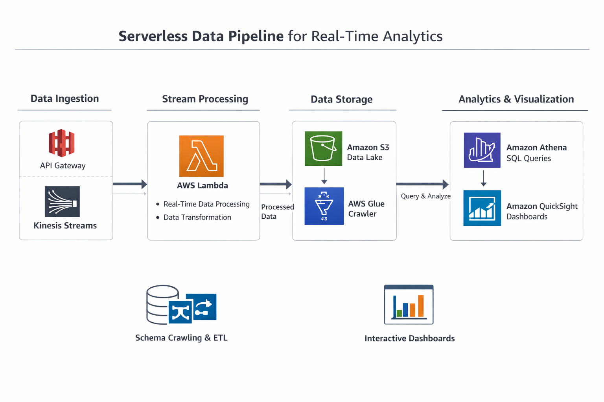

# Serverless-SIEM-Architecture
This project implements a serverless, real-time security analytics pipeline on AWS. The architecture is designed to ingest, process, store, and visualize user activity data for detecting anomalous behavior such as failed logins and suspicious IP activity.

## Architecture Diagram
This architecture represents a serverless, real-time security analytics pipeline built using AWS services.

The pipeline leverages the following AWS services:

- **Amazon API Gateway** – Handles incoming event data via REST API  
- **AWS Lambda (Ingestion)** – Processes and forwards incoming events  
- **Amazon Kinesis Data Streams** – Buffers and streams data in real time  
- **AWS Lambda (Processor)** – Transforms and enriches event data  
- **Amazon S3** – Stores processed data in a partitioned data lake  
- **AWS Glue** – Crawls and catalogs schema for querying  
- **Amazon Athena** – Enables SQL-based querying of data  
- **Amazon QuickSight** – Provides interactive SIEM-style dashboards 


## Data Flow

1. Client sends event data via API Gateway  
2. Lambda ingestion function processes and forwards events  
3. Events are streamed through Amazon Kinesis  
4. Processing Lambda transforms and enriches event data  
5. Data is stored in S3 using a partitioned structure (`year/month/day`)  
6. AWS Glue crawls and catalogs the data schema  
7. Athena queries the data using SQL  
8. QuickSight visualizes the data in a SIEM-style dashboard

## Table of Contents

1. [Prerequisites](#prerequisites)
2. [Step-by-Step Implementation](#step-by-step-implementation)

   - [1. Create S3 Bucket](#1-create-s3-bucket)
   - [2. Create Kinesis Stream](#2-create-kinesis-stream)
   - [3. Create IAM Role (Ingestion)](#3-create-iam-role-ingestion-lambda)
   - [4. Create Ingestion Lambda](#4-create-ingestion-lambda)
   - [5. Create API Gateway](#5-create-api-gateway)
   - [6. Test API](#6-test-api)
   - [7. Create IAM Role (Processor)](#7-create-iam-role-processor-lambda)
   - [8. Create Processor Lambda](#8-create-processor-lambda)
   - [9. Connect Kinesis Trigger](#9-connect-kinesis-trigger)
   - [10. Verify Data in S3](#10-verify-data-in-s3)
   - [11. Create Glue Crawler](#11-create-glue-crawler)
   - [12. Query with Athena](#12-query-with-athena)
   - [13. Generate Test Data](#13-generate-test-data)
   - [14. Setup QuickSight](#14-setup-quicksight)
   - [15. Build Dashboard](#15-build-dashboard)

3. [Troubleshooting](#troubleshooting)
4. [Final Results](#final-results)

## Prerequisites 

Before starting, ensure you have:

- AWS account  
- AWS Console access  
- Basic AWS knowledge  
- Terminal (Mac/Linux or Windows with Git Bash)  
- IAM permissions for Lambda, S3, Kinesis, Glue, Athena, and QuickSight  

> **Recommended Region:** `us-east-1 (N. Virginia)`


## Step-by-Step Implementation

### 1. Create S3 Bucket

Create an S3 bucket to store:

- Processed event data  
- Athena query results  

Create a bucket with a unique name, for example:

```
bl-serverless-analytics-001
```

Inside the bucket, create these folders:
```
processed/
athena-results/
```

### 2. Create Kinesis Stream

Create a Kinesis Data Stream named:

```
user-events-stream
```

Choose:

- On-demand mode

This stream will buffer events between the ingestion Lambda and the processing Lambda.

### 3. Create IAM Role (Ingestion Lambda)

Create an IAM role for the ingestion Lambda.

Attach:
- AWSLambdaBasicExecutionRole

Add an inline policy that allows writing to Kinesis:
```
{
  "Effect": "Allow",
  "Action": [
    "kinesis:PutRecord",
    "kinesis:PutRecords"
  ],
  "Resource": "*"
}
```
### 4. Create Ingestion Lambda

Create a Lambda function to send events to Kinesis.

**Function Name:** api-to-kinesis-ingest

**Runtime:** Python 3.x

Add environment variable:
```
STREAM_NAME=user-events-stream
```
Use this code:
```
import json
import os
import base64
import boto3
from datetime import datetime, timezone

kinesis = boto3.client("kinesis")
STREAM_NAME = os.environ["STREAM_NAME"]

def lambda_handler(event, context):
    try:
        body = json.loads(event["body"])
        
        body["ingest_time"] = datetime.now(timezone.utc).isoformat()

        kinesis.put_record(
            StreamName=STREAM_NAME,
            Data=json.dumps(body),
            PartitionKey=body.get("username", "unknown")
        )

        return {
            "statusCode": 200,
            "body": json.dumps({"message": "Event accepted"})
        }

    except Exception as e:
        return {
            "statusCode": 500,
            "body": json.dumps({"error": str(e)})
        }
```
### 5. Create API Gateway

Create an HTTP API.

Configure:

- Integration: Lambda
- Route:
 ```
POST /events
```
After deployment, your endpoint will look like:
```
https://YOUR_API_ID.execute-api.us-east-1.amazonaws.com/events
```
### 6. Test API
```
curl -X POST "yourAPIendpointhere" \
  -H "Content-Type: application/json" \
  -d '{
    "event_type": "login",
    "username": "jdoe",
    "source_ip": "10.1.2.10",
    "application": "portal",
    "event_time": "2026-03-24T22:30:00Z"
  }'
```
### 7. Create IAM Role (Processor Lambda)

Create a role for the processor Lambda.

Attach:
- AWSLambdaBasicExecutionRole
- AWSLambdaKinesisExecutionRole

Add S3 permission:
```
{
  "Effect": "Allow",
  "Action": [
    "s3:PutObject"
  ],
  "Resource": "addyourbucketnamehere"
}
```
### 8. Create Processor Lambda

Create a Lambda to process Kinesis data and store in S3.

**Function Name:** kinesis-to-s3-processor

**Runtime:** Python 3.x

Add environment variable:
```
BUCKET_NAME=bl-serverless-analytics-001(make sure its your bucket name)
```
Use this code:
```
import json
import os
import base64
import boto3
from datetime import datetime, timezone

s3 = boto3.client("s3")
BUCKET_NAME = os.environ["BUCKET_NAME"]

def lambda_handler(event, context):
    processed_count = 0

    for record in event["Records"]:
        try:
            payload = base64.b64decode(record["kinesis"]["data"]).decode("utf-8")
            data = json.loads(payload)

            event_time = data.get("event_time")
            if event_time:
                try:
                    dt = datetime.fromisoformat(event_time.replace("Z", "+00:00"))
                except Exception:
                    dt = datetime.now(timezone.utc)
            else:
                dt = datetime.now(timezone.utc)

            year = dt.strftime("%Y")
            month = dt.strftime("%m")
            day = dt.strftime("%d")

            output_key = (
                f"processed/year={year}/month={month}/day={day}/"
                f"{data.get('username', 'unknown')}-{int(datetime.now().timestamp() * 1000)}.json"
            )

            s3.put_object(
                Bucket=BUCKET_NAME,
                Key=output_key,
                Body=json.dumps(data),
                ContentType="application/json"
            )

            processed_count += 1

        except Exception as e:
            print(f"Failed to process record: {str(e)}")

    return {
        "statusCode": 200,
        "body": json.dumps({"processed_records": processed_count})
    }
```
### 9. Connect Kinesis Trigger

Attach the Kinesis stream to the processor Lambda.

Configure:
- Source: Kinesis
- Stream: user-events-stream
- Starting position: Latest

Note: Only events sent after the trigger is attached will be processed. 

### 10. Verify Data in S3

Send a fresh event through the API, then check this path in S3:
```
processed/year=YYYY/month=MM/day=DD/
```
You should see .json files.
```
jdoe-1774383715543.json
newuser-1774385823199.json
```

### 11. Create Glue Crawler

Create a Glue crawler to catalog the processed JSON files.

Use:
```
s3://bl-serverless-analytics-001/processed/ **(Copy and Paste your bucketname/processed/)**
```
Database:
```
analytics_db
```
Run the crawler.

After it completes, confirm a table such as processed appears in the Glue Data Catalog.

### 12. Query with Athena

In Amazon Athena, set the query results location to:
```
s3://bl-serverless-analytics-001/athena-results/ **(Copy and Paste your bucketname/processed/)**
```
Then run:
```
MSCK REPAIR TABLE processed;
```
Verify the data:
```
SELECT * 
FROM processed
LIMIT 10;
```
Useful queries:
```
SELECT COUNT(*) AS total_events
FROM processed;
```
```
SELECT event_type, COUNT(*) AS count
FROM processed
GROUP BY event_type
ORDER BY count DESC;
```
```
SELECT username, COUNT(*) AS count
FROM processed
GROUP BY username
ORDER BY count DESC;
```
```
SELECT source_ip, COUNT(*) AS attempts
FROM processed
GROUP BY source_ip
ORDER BY attempts DESC;
```
### 13. Generate Test Data

Use a script to generate realistic event data.

**Normal activity simulation**
```
USERNAMES=("jdoe" "asmith" "bjohnson" "mwilliams" "dlee" "kpatel" "rgarcia" "tnguyen" "jkim" "ssingh" "mbrown" "awilson")
APPS=("portal" "vpn" "sharepoint" "onedrive" "okta" "salesforce" "slack" "github")
EVENT_TYPES=("login" "logout" "download" "upload" "file_access" "login_failure")
IPS=("10.1.2.10" "10.1.2.11" "10.1.2.12" "10.1.2.13" "10.1.2.14" "172.16.1.5" "172.16.1.6" "192.168.1.10" "192.168.1.11")

for i in {1..300}
do
  USER=${USERNAMES[$RANDOM % ${#USERNAMES[@]}]}
  APP=${APPS[$RANDOM % ${#APPS[@]}]}
  EVENT=${EVENT_TYPES[$RANDOM % ${#EVENT_TYPES[@]}]}
  IP=${IPS[$RANDOM % ${#IPS[@]}]}
  MINUTE=$(printf "%02d" $((RANDOM % 60)))
  SECOND=$(printf "%02d" $((RANDOM % 60)))

  curl -s -X POST "https://YOUR_API_ID.execute-api.us-east-1.amazonaws.com/events" \
    -H "Content-Type: application/json" \
    -d "{
      \"event_type\": \"$EVENT\",
      \"username\": \"$USER\",
      \"source_ip\": \"$IP\",
      \"application\": \"$APP\",
      \"event_time\": \"2026-03-24T22:$MINUTE:$SECONDZ\"
    }"
done
```
**Attack Simulation**
```
for i in {1..80}
do
  MINUTE=$(printf "%02d" $((RANDOM % 60)))
  SECOND=$(printf "%02d" $((RANDOM % 60)))

  curl -s -X POST "https://YOUR_API_ID.execute-api.us-east-1.amazonaws.com/events" \
    -H "Content-Type: application/json" \
    -d "{
      \"event_type\": \"login_failure\",
      \"username\": \"jdoe\",
      \"source_ip\": \"203.0.113.50\",
      \"application\": \"vpn\",
      \"event_time\": \"2026-03-24T22:$MINUTE:$SECONDZ\"
    }"
done
```
After generating more data, run again in Athena:
```
MSCK REPAIR TABLE processed;
```
### 14. Setup QuickSight

Sign up for Amazon QuickSight if needed.

Grant QuickSight access to:
- Amazon Athena
- Amazon S3

Allow access to this bucket:
```
bl-serverless-analytics-001
```
If QuickSight shows permission errors, go to:
- Manage Account
- AWS resources

Then enable Athena and S3 access.

### 15. Build Dashboard

Create these visuals in QuickSight:
- Total Events KPI
- Login Failures KPI
- Unique Users KPI
- Unique Source IPs KPI
- Login Failure Trend line chart
- Application Activity pie chart
- Event Type Breakdown donut chart
---

### Dashboard Preview

Below is the final SIEM-style dashboard built using Amazon QuickSight:


---

### Dashboard Insights

The dashboard provides real-time visibility into security events, including:

- **Total Events:** 725+ events ingested and processed  
- **Login Failures:** 50 failed login attempts detected  
- **Unique Users:** 23 distinct users  
- **Unique Source IPs:** 25 unique IP addresses  

Additional visualizations include:

- **Login Failure Trend** to identify spikes and anomalies  
- **Application Activity Breakdown** to monitor usage patterns  
- **Event Type Distribution** to detect abnormal behavior  

This allows for quick identification of suspicious activity such as brute-force login attempts and unusual access patterns.


### Troubleshooting

Common issues:
- API connected to wrong Lambda
- Missing IAM permissions
- Incorrect S3 bucket name
- Forgot:
  ```
  MSCK REPAIR TABLE processed;
  ```

### Final Results
  - 700+ events processed
  - Login failure detection
  - Real-time analytics pipeline
  - SIEM-style dashboard
